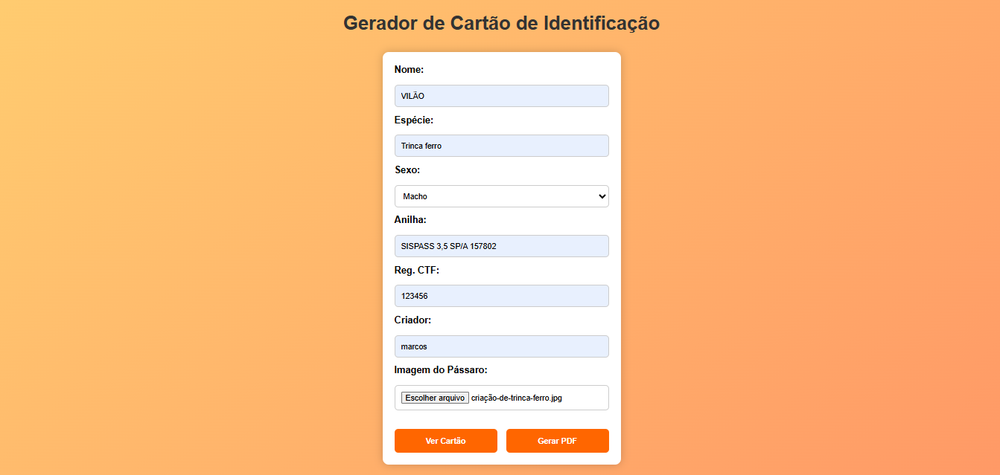
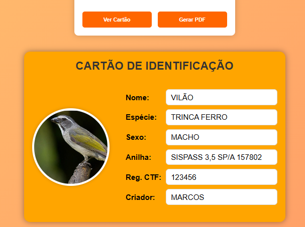
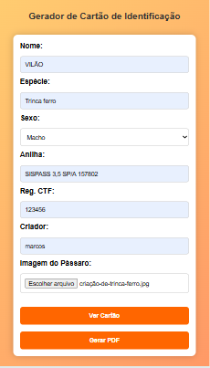
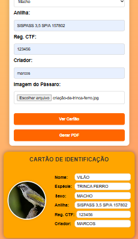

# Gerador de Cartão de Identificação

Uma aplicação web simples para gerar cartões de identificação para pássaros, com opção de exportação em PDF.

Acesse em: [CardGenerator](https://ismaelsidney.github.io/cardgenerator/)

## Funcionalidades

- Formulário para preenchimento dos dados do pássaro
- Upload de imagem do pássaro
- Visualização prévia do cartão em tempo real
- Geração de PDF no formato A4 paisagem (cartão 10.4x6.8cm)
- Conversão automática dos textos para maiúsculas
- Design responsivo
- Interface amigável e intuitiva

## Campos do Cartão

- Nome do pássaro
- Espécie
- Sexo (Macho/Fêmea)
- Número da Anilha
- Registro CTF
- Nome do Criador
- Foto do pássaro

## Como Usar

1. Abra o arquivo `index.html` em um navegador web moderno
2. Preencha todos os campos do formulário
3. Faça upload da foto do pássaro
4. Clique em "Ver Cartão" para visualizar
5. Clique em "Gerar PDF" para baixar o cartão em PDF

## Requisitos Técnicos

- Navegador web moderno com suporte a JavaScript
- Conexão com internet (para carregar as bibliotecas CDN)

## Bibliotecas Utilizadas

- html2canvas (v1.4.1) - Para captura do cartão
- jsPDF (v2.5.1) - Para geração do PDF

## Estrutura do Projeto

```
├── index.html
├── style.css
├── script.js
└── README.md
```

## Preview






## Licença

MIT © 2025
